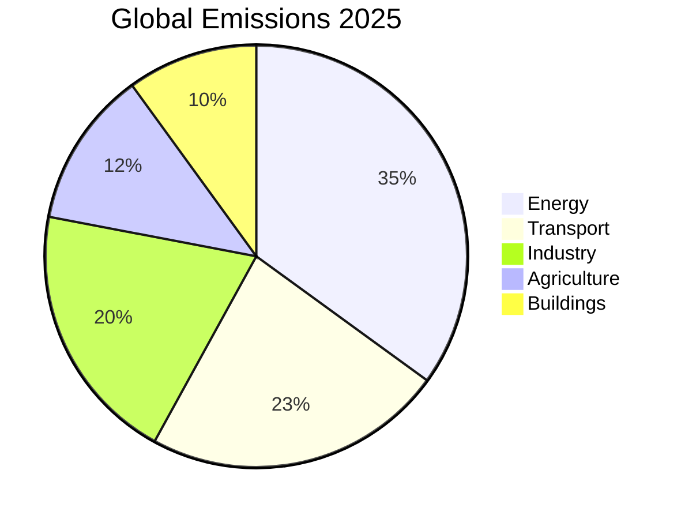
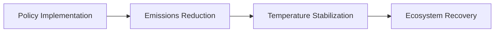

# Global Warming Crisis 2025
## The Critical Decade for Climate Action

  
    Press Space for next page <carbon:arrow-right class="inline"/>
  

---
layout: image-right
image: https://images.unsplash.com/photo-1470071459604-3b5ec3a7fe05
---

# Current State of Climate

- Global temperature rise of 1.5°C above pre-industrial levels
- Record-breaking heat waves worldwide
- Accelerated polar ice melting
- Rising sea levels affecting coastal communities
- Increased frequency of extreme weather events

## Key Statistics 2025
- CO₂ levels: 425+ ppm
- Arctic sea ice decline: 13% per decade
- Global sea level rise: 4.5mm/year

---
layout: two-cols
---

# Major Contributors

<v-clicks>

- Fossil fuel emissions
- Deforestation
- Industrial processes
- Agricultural practices
- Transportation
- Urban development

</v-clicks>

::right::

## Sector-wise Emissions

---
layout: center
---

# Environmental Impacts

## Ecosystem Disruption
- Biodiversity loss
- Coral reef bleaching
- Forest fires
- Species extinction
- Ocean acidification

## Human Impact
- Food security threats
- Water scarcity
- Health risks
- Climate refugees
- Economic disruption

---
layout: image-left
image: https://images.unsplash.com/photo-1497435334941-8c899ee9e8e9
---

# Technological Solutions

<v-clicks>

- Renewable Energy Integration
  - Solar and wind power expansion
  - Green hydrogen development
  - Advanced energy storage

- Carbon Capture Technologies
  - Direct air capture
  - Industrial carbon sequestration

- Smart Grid Systems
  - AI-powered energy management
  - Decentralized power distribution

</v-clicks>

---

# Global Initiatives 2025

## Policy Actions
- Enhanced Paris Agreement targets
- Carbon pricing mechanisms
- Green infrastructure investment
- Renewable energy mandates

## International Cooperation
- Climate finance commitments
- Technology transfer programs
- Cross-border carbon markets
- Global monitoring systems

## Progress Tracking

---
layout: two-cols
---

# Individual Action

<v-clicks>

- Sustainable lifestyle choices
- Energy-efficient practices
- Reduced consumption
- Waste management
- Green transportation
- Community engagement

</v-clicks>

::right::

# Corporate Responsibility

- Net-zero commitments
- Sustainable supply chains
- Green technology adoption
- Environmental reporting
- Circular economy practices

---
layout: center
class: text-center
---

# Call to Action

## The Time for Change is Now

<v-clicks>

- Support climate policies
- Adopt sustainable practices
- Invest in green technologies
- Educate and spread awareness
- Join climate initiatives

</v-clicks>

  <a href="https://www.ipcc.ch" target="_blank" alt="IPCC Website" 
    class="text-xl icon-btn opacity-50 !border-none !hover:text-white">
    <carbon-globe />
  </a>

